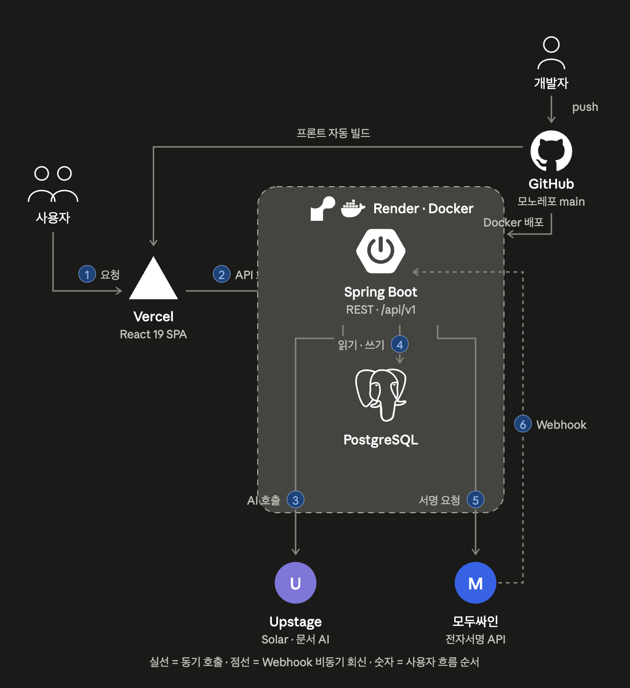
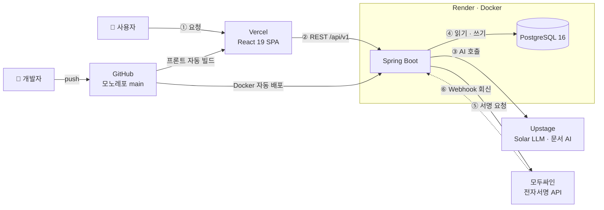

# 👾 잇다 ITDA

> **Upstage Solar LLM AI & CLM 전자서명 기반 AI 기부·봉사 커뮤니티 플랫폼**  
> **AI Builder Sprint 2026** (부산대학교 APPTIVE 주최 / Upstage 후원)

[](https://itdafront.vercel.app)


**바로가기** · [배포 주소·데모 계정](#-배포-주소-및-라이브-데모-계정) · [로컬 실행](#-로컬-실행-가이드) · [AI 활용 증빙](#-2-ai-활용-증빙) · [핵심 기능](#-3-주요-핵심-기능) · [프로젝트 구조](#-4-프로젝트-구조) · [기술 스택](#-5-기술-스택) · [개발 AI 활용](#-6-개발-과정의-ai-활용) · [팀원](#-7-팀원-소개)

---

## 🔗 배포 주소 및 라이브 데모 계정

| 구분 | 주소 및 정보 |
|---|---|
| **서비스 웹 (프론트엔드)** | [https://itdafront.vercel.app](https://itdafront.vercel.app) |
| **API 서버 (백엔드)** | `https://ai-builder-sprint.onrender.com` |
| **데모 계정 (센터 관리자)** | `manager@pixelcare.demo` / `Manager123!` |
| **데모 계정 (운영진)** | `operator@pixelcare.local` / `Operator123!` |
| **데모 계정 (일반 사용자)** | `donor@pixelcare.demo` / `Donor123!` |

> 💡 **백엔드 접속 안내**: 백엔드는 Render 무료 인스턴스로 접속이 없으면 절전 상태가 됩니다. 첫 요청 시 백엔드 상향까지 50초 남짓 걸릴 수 있습니다.

---

## 🚀 로컬 실행 가이드

### 요구 사항
- Java 17+ (배포 환경은 Java 21), Node.js 20+, Docker (PostgreSQL 컨테이너용)

### 1) 환경변수 준비
```bash
cp .env.example .env
```
`.env.example`에 로컬 기본값이 채워져 있어 그대로 사용하면 됩니다. 주요 환경변수:

| 변수 | 용도 | 로컬 기본값 |
|---|---|---|
| `SPRING_DATASOURCE_URL` / `USERNAME` / `PASSWORD` | PostgreSQL 접속 정보 | `jdbc:postgresql://127.0.0.1:5432/pixelcare` / `pixelcare` / `pixelcare_local` |
| `UPSTAGE_API_KEY` | Solar LLM · Document Parse · Information Extract | 비워두면 내장 Smart Failover 폴백으로 동작 |
| `MODUSIGN_USER_EMAIL` / `MODUSIGN_API_KEY` / `MODUSIGN_TEMPLATE_ID` | 모두싸인 전자서명 연동 | 비워두면 전자서명 요청 단계만 비활성 |
| `APP_BOOTSTRAP_ENABLED` | 데모 계정·시드 데이터 자동 생성 | `true` |

### 2) 데이터베이스 기동
```bash
docker compose up -d postgres
```

### 3) 백엔드 실행 (http://localhost:8080)
```bash
cd backend && ./gradlew bootRun
```

### 4) 프론트엔드 실행 (http://localhost:5173)
```bash
cd frontend && npm install && npm run dev
```

첫 실행 시 데모 계정 3종(위 표 참조)과 시드 데이터가 자동 생성됩니다.
프론트엔드는 별도 설정 없이 `http://localhost:8080` 백엔드를 바라봅니다 (`VITE_API_BASE_URL`로 변경 가능).

### 실행/배포 환경 정보
| 구분 | 환경 |
|---|---|
| 프론트엔드 배포 | Vercel (`frontend/vercel.json` SPA rewrite) |
| 백엔드 배포 | Render (Docker, `backend/Dockerfile` — Java 21 + 한글 폰트 포함) |
| 데이터베이스 | PostgreSQL 16 (Render / 로컬 Docker) |
| 테스트 | `cd backend && ./gradlew test` (JUnit 5, 55개) |

---

## 📌 프로젝트 개요

**잇다 ITDA**는 "선행의 의지"를 AI와 전자서명으로 끝까지 잇는 기부·봉사 커뮤니티 플랫폼입니다.

- 🧠 **AI가 마음을 정리합니다** — 자연어 몇 마디로 기부·봉사 의향(일반 기부, 고향사랑기부제, 유산기부, 문화유산 후원)을 구조화하고 맞춤 프로그램을 추천합니다.
- ✍️ **전자서명으로 약속을 남깁니다** — 약정서 자동 생성부터 모두싸인 서명, 체결본·감사추적 보관, 정기 약정 갱신까지 한 흐름으로 이어집니다.
- 🤝 **이웃이 선행을 제안합니다** — CONNECT(온기 잇다)에서 원하는 선행을 역제안하면, 이웃의 응원을 모아 센터가 정식 프로그램으로 개설합니다.

---

## 🎯 1. 기획 배경 및 문제 정의

### 👥 타겟 사용자

| 역할 | 누구인가 |
|---|---|
| 일반 사용자 (`USER`) | 나에게 맞는 봉사 · 기부를 찾고, 원하는 선행을 직접 역제안하고 싶은 사람 |
| 센터 관리자 (`CENTER_MANAGER`) | 프로그램을 개설하고 신청자와 서명 증빙을 관리하는 기관 담당자 |
| 운영진 (`OPERATOR`) | 센터 · 관리자 승인과 게시물 관리, 감사 로그를 맡는 플랫폼 운영 주체 |

### 🚨 문제 → 💡 해결

| 문제 | 잇다의 해결 |
|---|---|
| 흩어진 공고, 탐색 피로 | Solar LLM 대화로 성향(지역 · 시간 · 감정)에 맞는 활동을 추천 |
| 봉사자가 제안할 창구 부재 | CONNECT 역제안 — 이웃 응원을 모으면 센터가 수락해 정식 개설 |
| 복잡한 약정 서류와 갱신 절차 | AI가 의향을 구조화해 약정서를 자동 생성, 전자서명 · 갱신까지 한 흐름 |
| 약정 원본의 무결성 증명 불가 | 체결본을 SHA-256 해시로 보관하고 Document AI로 원본과 대조 검증 |

---

## 🤖 2. AI 활용 증빙

### 🧠 사용 AI 모델
| API | 모델 | 계약 파이프라인에서 맡는 일 |
| :--- | :--- | :--- |
| **Solar LLM** | `solar-pro3` | 대화로 약정 의사를 정리하고, 체결 후 감사 인사를 씀 |
| **Document Parse** | `document-parse` | 체결된 약정서 PDF에서 글자를 되읽음 |
| **Information Extract** | `information-extract` | 되읽은 약정서를 고정 스키마로 구조화 |

### 📍 API 사용 위치
- **Solar 대화 클라이언트**: `backend/src/main/java/com/pixelcare/domain/ai/service/UpstageApiClient.java`
- **문서 AI 클라이언트**: `backend/src/main/java/com/pixelcare/domain/ai/service/UpstageDocumentClient.java`
- **대화 및 선행 큐레이팅**: `backend/src/main/java/com/pixelcare/domain/ai/service/AiMateService.java`
- **의향 파싱 & 스키마 구조화**: `backend/src/main/java/com/pixelcare/domain/ai/service/AiConsultationService.java`
- **체결본 대조 검증**: `backend/src/main/java/com/pixelcare/domain/clm/service/ClmDocumentVerificationService.java`

### 🔍 체결본 대조 검증
서명이 끝났다는 사실만으로는 **무엇에 서명했는지**를 증명하지 못합니다.
잇다는 보관된 체결본을 다시 읽어, 신청할 때 정한 조건 그대로 서명됐는지 항목별로 대조합니다.

```
체결본 PDF → Document Parse(글자 추출) → Information Extract(항목 구조화)
           → DB 약정 원본과 대조 → 항목별 일치/불일치 표시
```

- 대조 항목: 약정자 · 수혜기관 · 약정 금액 · 약정 주기
- 표기 차이를 감안합니다. `"120,000 원"`은 숫자만 비교하고, `ANNUAL`은 약정서 표기인 `"연간 정기 후원"`과 맞춥니다.
- 읽어내지 못하면 결과를 지어내지 않고 `UNREADABLE`로 남깁니다.
- API: `POST /api/v1/clm/documents/{id}/verification`

### ⚙️ 프롬프트 및 설정

| 설정 | 내용 |
|---|---|
| 프롬프트 페르소나 | 친근하고 따뜻한 마스코트 `ITDA AI Mate` |
| JSON 스키마 추출 | 대화문에서 희망 지역 · 활동 시간 · 기부 주기 · 금액 · 답례품 희망 여부를 고정 스키마로 파싱 (temperature=0) |
| 외부 전송 동의 | 사용자가 동의한 경우에만 외부 LLM에 전송, 동의 시각을 `externalAiConsentAt`으로 기록 |
| Smart Failover | API 키 미설정 · 네트워크 장애 시 외부 요청 없이 동작하는 내장 폴백 (`AiMateService.java`) |

---

## ✨ 3. 주요 핵심 기능

### 1. 🤖 AI 대화 파이프라인 — `ITDA AI Mate`

| 기능 | 설명 |
|---|---|
| 자연어 선행 큐레이팅 | "주말에 부산 해운대에서 할 수 있는 봉사 추천해줘" 한 마디로 맞춤 프로그램 추천 |
| 의향 구조화 | 희망 지역 · 활동 시간 · 기부 주기 · 금액 · 답례품 희망 여부를 고정 JSON 스키마로 추출 |
| 외부 전송 동의 | 동의한 경우에만 Upstage에 전송, 미동의 시 내장 폴백으로 동일하게 동작 |

### 2. 🤝 CONNECT — 온기 잇다 (선행 역제안)

| 기능 | 설명 |
|---|---|
| 자유 역제안 | 원하는 봉사 · 기부 아이디어를 직접 작성해 플랫폼에 등록 |
| AI 챗봇 연동 | AI 대화 중 도출된 미션을 즉시 CONNECT 초안으로 자동 연결 |
| 응원 → 수락 → 개설 | 이웃 응원(`Support`)이 모이면 센터가 수락(`Claim`)해 정식 모집 공고로 개설 |

### 3. 📝 CLM 전자서명 파이프라인 — 모두싸인 연동

| 기능 | 설명 |
|---|---|
| 약정서 자동 생성 | AI가 정리한 의향을 약정 유형별 서식의 PDF로 자동 생성 |
| 전자서명 요청 | 모두싸인 보안 링크로 서명 요청, 웹훅 · 폴링으로 상태 실시간 동기화 |
| 증빙 보관 | 체결본 · 감사추적인증서를 SHA-256 해시와 함께 이중 보관 |
| 갱신 · 변경 관리 | 정기 약정 만료 전 갱신, 조건이 바뀌면 재서명 요구 |

### 4. 🏛️ 유형별 특화 약정 — 부산 고향사랑기부제 · 유산 · 문화유산

| 약정 유형 | 특화 내용 |
|---|---|
| 🌾 고향사랑기부 (`HOMETOWN_DONATION`) | 부산 답례품 선택(동백전 지역화폐 등), 세액공제 자동 산정(연 10만원 전액 공제), 지자체 전용 약정서 |
| 🏛️ 유산기부 · 문화유산 후원 (`LEGACY_DONATION` / `CULTURAL_HERITAGE_DONATION`) | 민법 제1060조 유증 방식 안내, 지정 문화유산 항목을 담은 전용 서식, 유네스코 카탈로그 필터 |
| 🤝 일반 봉사 · 기부 (`VOLUNTEER` / `DONATION`) | 맞춤 봉사 활동과 정기 · 일시 기부 약정 |

### 5. 🛡️ 계정 역할별 화면

| 역할 | 하단 탭 구성 |
|---|---|
| 일반 사용자 (`USER`) | 홈 · 선행하기 · 커뮤니티 · 내 기록 |
| 센터 관리자 (`CENTER_MANAGER`) | 위 4개 + 센터 관리 (모집글 · 신청자 · 서명 증빙 · 온기 잇다 요청) |
| 운영진 (`OPERATOR`) | 위 4개 + 운영 관리 (권한 · 센터 승인, 소프트 삭제, 감사 로그) |

---

## 📁 4. 프로젝트 구조

### 🗺️ 시스템 아키텍처

<p align="center">
  
</p>

<details>
<summary>텍스트 다이어그램으로 보기</summary>



</details>

### 📂 디렉터리 구성

```text
AI-Builder-Sprint/
├── README.md                          # 프로젝트 메인 설명서
├── docker-compose.yml                 # 로컬 개발용 PostgreSQL Docker 설정
├── docs/                              # 상세 설계 및 명세 문서군
│   ├── AGENTS.md                      # AI 에이전트 시스템 지침 파일
│   ├── PLAN.md                        # 기획 및 로드맵
│   ├── ARCHITECTURE.md                # 시스템 아키텍처 명세서
│   ├── API_SPEC.md                    # REST API 명세서
│   ├── DB_SCHEMA.md                   # 데이터베이스 스키마 명세서
│   ├── SKILL.md                       # 디자인 시스템 스킬 지침
│   ├── TEAM_CONVENTIONS.md            # 팀 협업 가이드라인
│   ├── PITCH_NOTES.md                 # 발표 대본 및 Q&A 대비 노트
│   └── workflow.md                    # 서비스 기획서
│
├── backend/src/main/java/com/pixelcare/
│   ├── domain/ai/                     # 🤖 Upstage Solar LLM AI & Smart Failover
│   ├── domain/clm/                    # 📝 CLM 약정서 & 모두싸인 Webhook / SHA-256
│   ├── domain/user/                   # 📜 유저, 온기 온도계, 뱃지 도감
│   ├── domain/management/             # 🏢/🛡️ 센터 관리자 & 운영진 승인/감사로그
│   ├── domain/opportunity/            # 🎁 봉사/기부 공고 관리
│   ├── domain/application/            # 📋 공고 신청 & 출석 처리
│   ├── domain/connect/                # 🤝 CONNECT 선행 역제안 & Support/Claim
│   ├── domain/community/              # 💬 커뮤니티 후기 & 소프트 삭제
│   ├── domain/journal/                # 📖 봉사 일지
│   ├── domain/news/                   # 📰 미담 뉴스 큐레이팅
│   ├── domain/stats/                  # 📊 실시간 플랫폼 통계
│   └── domain/file/                   # 📁 파일 저장소
│
└── frontend/src/
    ├── components/                    # 탭별 React 컴포넌트
    │   ├── ai/                        # 🤖 Pixel AI Mate 챗봇
    │   ├── auth/                      # 🔐 로그인 & 회원가입
    │   ├── center/                    # 🏢 센터 관리 대시보드
    │   ├── common/                    # Header, Modal, Toast 등
    │   ├── connect/                   # 🤝 CONNECT 역제안 & 응원
    │   ├── diary/                     # 📖 봉사 일지
    │   ├── home/                      # 🏠 홈 (AI 큐레이터 진입점)
    │   ├── news/                      # 📰 미담 뉴스
    │   ├── operator/                  # 🛡️ 운영 관리
    │   ├── roadmap/                   # 🗺️ 성장의 길 & 뱃지 도감
    │   ├── user/                      # 📜 내 기록
    │   └── volunteer/                 # 🎁 선행하기 (봉사/기부 카탈로그)
    ├── services/                      # REST API 모듈 (14개 API 파일)
    ├── hooks/                         # 커스텀 React Hook
    ├── types/                         # TypeScript 타입 명세
    ├── utils/                         # 유틸리티 함수
    └── App.tsx                        # 3단계 역할별 가변 탭 라우터
```

---

## 🛠️ 5. 기술 스택

| 구분 | 사용 기술 명세 |
| :--- | :--- |
| **Frontend** | React 19.2.7, TypeScript, Vite, Editorial Bento Grid CSS (Vercel Deployment) |
| **Backend** | Java 21, Spring Boot 3.3.4, Spring Data JPA, JdbcTemplate (Render Cloud) |
| **Database** | PostgreSQL (Render Deployment), PostgreSQL 16-alpine (Local Docker) |
| **AI LLM** | Upstage Solar LLM API (`solar-pro3`) |
| **E-Signature** | 모두싸인 (Modusign) Webhook API & PDF SHA-256 Archive |
| **DB Migration** | Spring Boot Native SQL Initialization (`spring.sql.init.platform=postgresql`) |
| **Testing** | JUnit 5, Gradle Test Runner |

---

## 🤝 6. 개발 과정의 AI 활용

서비스 안의 AI(Upstage)와 별개로, 개발 과정 자체를 AI 코딩 에이전트(Claude Code)와 함께 진행했습니다.

| 구분 | 내용 |
|---|---|
| 에이전트 지침 | [`CLAUDE.md`](CLAUDE.md) · [`docs/AGENTS.md`](docs/AGENTS.md) — 프로젝트 규칙 · 페르소나 · 외부 API 폴백 원칙을 지침 파일로 두고 세션마다 일관되게 적용 |
| 커스텀 스킬 | [`.agents/skills/pixel-roadmap-design`](.agents/skills/pixel-roadmap-design/SKILL.md) — 벤토 그리드 디자인 시스템을 스킬로 정의해 전 화면의 UI 규격 통일 |
| 활용 방식 | 기획([`docs/workflow.md`](docs/workflow.md)) → 구현 → 테스트 → 문서 동기화 전 과정을 에이전트와 페어로 진행. 한국어 서술형 커밋 160여 개가 그 협업 기록 |
| AI가 기여한 사례 | 배포 DB(PostgreSQL)에서만 터지던 MySQL 전용 SQL 수정, 트랜잭션 rollback-only 오염 진단, 커넥션 풀 고갈 원인 분석과 헬스체크 분리, 죽은 코드 감사 등 |

---

## 👥 7. 팀원 소개

| 이름 | 역할 | 담당 업무 |
| :---: | :---: | :--- |
| **권윤재** | **Full Stack Developer** | • React 19 + TypeScript 기반 Editorial Bento Grid 디자인 시스템 구축<br>• 3단계 계정 역할별 가변 하단 탭 내비게이션 라우팅 및 전단 UI 개발<br>• CONNECT(온기 잇다) 역제안 프론트엔드 및 백엔드 연동 |
| **이영민** | **Full Stack Developer** | • Upstage Solar LLM 프롬프트 페르소나 설계 및 JSON 의향 파싱 엔진 구축<br>• 로컬 Smart Failover Engine 개발 및 외부 AI 전송 동의(Opt-in) 제어<br>• 센터 관리자 대시보드 및 실시간 플랫폼 통계 기능 개발 |
| **전동훈** | **Full Stack Developer** | • Spring Boot 백엔드 아키텍처 설계 및 PostgreSQL Native Initialization 구축<br>• Upstage Solar LLM 연동, CLM 전자서명 및 모두싸인 Webhook 파이프라인 개발<br>• 3단계 권한 승인 워크플로우, 소프트 삭제 및 감사 로그 시스템 구축 |

---

> **AI Builder Sprint 2026** — 잇다 ITDA
