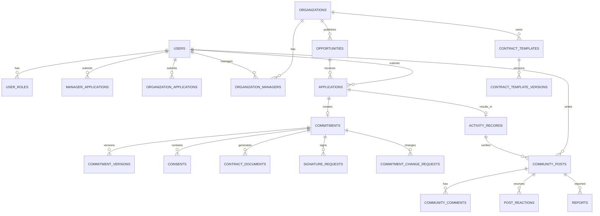

# 잇다 ITDA CLM 데이터베이스 설계

> 문서 버전: `v1.3`
>
> 개발·운영 DB: PostgreSQL 16 (Render / 로컬 Docker)
>
> 자동 테스트 DB: H2 인메모리
>
> 스키마 적용: Spring Boot Native SQL Initialization (`schema-postgresql.sql`) + JPA `ddl-auto: update`
>
> ⚠️ 아래 본문 중 MySQL 8.4·Flyway 관련 서술은 초기 설계 단계의 이력 기록이다. 현재 실행 스키마의 원천은 `backend/src/main/resources/schema-postgresql.sql`이며, Flyway는 비활성 상태다.

---

## 1. 어디에서 관리하는가

팀원이 하나의 DB 서버를 공유할 필요는 없다. 각자 로컬 DB를 사용하되 Git에 커밋된 Flyway Migration을 동일하게 적용하면 스키마가 일치한다.

로컬 개발에서는 저장소 루트의 `docker-compose.yml`로 MySQL 8.4를 실행한다. 접속정보와 외부 API 키는 `.env`에서 관리하고, Git에는 로컬 개발 기본값만 담은 `.env.example`을 커밋한다.

| 위치 | 역할 | 기준 |
|---|---|---|
| `docs/DB_SCHEMA.md` | ERD, 테이블 설명, 관계와 정책 | 사람이 읽는 설계 기준 |
| `backend/src/main/resources/db/migration/*.sql` | 실제 DB 변경 이력 | 실행 기준·최종 Source of Truth |
| JPA Entity | 애플리케이션 객체 매핑 | Flyway 스키마와 일치해야 함 |

`spring.jpa.hibernate.ddl-auto=validate`를 유지한다. Hibernate가 스키마를 임의 생성하지 않고 Flyway 스키마와 Entity가 다르면 실행 시 실패하도록 한다.

### 로컬 DB 접속 기본값

| 항목 | 기본값 |
|---|---|
| Host | `localhost` |
| Port | `3307` (컨테이너 내부 `3306`) |
| Database | `pixelcare` |
| User | `pixelcare` |
| JDBC URL | `jdbc:mysql://127.0.0.1:3307/pixelcare` |

비밀번호는 `.env`에서만 관리한다. 운영 환경에서는 로컬 기본 비밀번호를 사용하지 않고 배포 환경의 Secret으로 주입한다.

### 필수 규칙

1. 이미 Git에 올라갔거나 다른 팀원이 적용한 Migration은 수정하지 않는다.
2. DB 변경은 항상 새로운 `V{번호}__설명.sql`로 추가한다.
3. Entity 변경과 Migration SQL을 같은 PR에 포함한다.
4. 외래키, `UNIQUE`, `NOT NULL` 같은 핵심 규칙은 DB에도 적용한다.
5. 운영 데이터·개인정보·비밀키를 Migration이나 Seed에 넣지 않는다.
6. 위험한 `DROP`, 컬럼 삭제, 대량 데이터 변경은 팀 리뷰 후 진행한다.
7. 공개 콘텐츠는 정상 양수 `BIGINT id`를 URL에 사용할 수 있다. 민감한 업무 자원은 `public_id`만 노출한다.

---

## 2. Flyway 버전 계획

현재 `V1__init_schema.sql`은 레거시 `volunteers`, `volunteer_tags`, `posts`를 생성한다. V1은 수정하지 않는다.

`V2__create_clm_schema.sql`은 최초 작성 당시 H2에서만 검증되어 MySQL의 `DATETIME(6)` 기본값 정밀도와 맞지 않았다. 팀 공용 MySQL 도입 전에 `CURRENT_TIMESTAMP(6)`로 호환 문법을 보정했으며, 2026-07-30에 빈 MySQL 8.4 DB에서 V1~V3 전체 적용을 확인했다. 이 시점 이후 V1~V3은 수정하지 않고 V4 이상의 보정 Migration만 추가한다.

| 버전 | 영역 | 테이블 | 상태 |
|---|---|---|---|
| V1 | 기존 초기 구조 | `volunteers`, `volunteer_tags`, `posts` | [x] MySQL 8.4 적용 |
| V2 | CLM 전체 기반 스키마 | 사용자, 기관, AI, 선행 기회, 신청, 약정, 전자서명, 이행, 커뮤니티, 운영·알림 | [x] MySQL 8.4 적용 |
| V3 | 공개 식별자 | 신청·약정·문서·서명 `public_id` | [x] MySQL 8.4 적용 |
| V4 | 외부 봉사 연동 제거 | 레거시 봉사 링크 컬럼과 연동 태그 제거 | [x] MySQL 8.4 적용 |
| V5 | MVP API 연결 필드 | 로그인 토큰, 관리자 신청·센터·모집글·신청 필드 | [x] MySQL 8.4 적용 |
| V6 | 관리자 증빙 연결 | 관리자 신청과 여러 업로드 파일의 연결 테이블 | [x] MySQL 8.4 적용 |
| V7 | 커뮤니티 작성자 연결 | `posts.author_user_id`와 사용자 FK·삭제 권한 조회 인덱스 | [x] MySQL 8.4 적용 |
| V8~V15 | 커뮤니티·모두싸인·AI-CLM 연결 | 댓글·서명문서·지역 데이터·응원·AI 약정 연결 | [x] MySQL 8.4 적용 |
| V16 | 외부 AI 동의 감사 | `ai_consultations` 동의 시각·제공자 | [x] MySQL 8.4 적용 |
| V17+ | 후속 변경 | 기능 구현 중 추가·변경되는 컬럼과 제약 | [ ] |
| 별도 버전 | 레거시 이전 | V1 데이터를 신규 도메인 테이블로 이전 | [ ] |

`V2__create_clm_schema.sql`이 전체 기반 테이블을 한 번에 생성한다. 이후에는 V1~V3을 수정하지 않고 V4부터 변경분만 추가한다.

### V2 호환 테이블

- `posts`, `comments`: 현재 커뮤니티 JPA 코드가 사용하는 레거시 호환 구조
- `volunteers`, `volunteer_tags`: V1에서 유지되는 기존 봉사 목록
- `chat_messages`: 현재 AI 채팅 JPA 코드가 사용하는 호환 구조
- `community_posts`, `community_comments`: 신규 사용자 기반 커뮤니티의 목표 구조

---

## 3. 핵심 ERD



---

## 4. 공통 타입과 컬럼

- 기본 PK: `BIGINT AUTO_INCREMENT`
- 공개 콘텐츠 `id`: 센터·모집글처럼 공개 목록에서 조회되는 자원은 정상 양수 PK를 URL에 사용할 수 있다.
- 비공개 흐름 `public_id`: 신청, 약정, 계약문서, 서명요청처럼 열거 공격을 막아야 하는 자원에 UUID를 사용한다.
- 음수 ID, 배열 순번, 임시 증가값을 데모·시드·URL 식별자로 사용하지 않는다.
- 시간: `DATETIME(6)`, 애플리케이션은 UTC 저장
- 금액: 원 단위 `BIGINT`
- 봉사시간: 오차 방지를 위해 분 단위 `INT`
- 상태·유형 enum: `VARCHAR(30~50)`
- 스냅샷·AI 구조화 데이터: MySQL `JSON`
- 문서·이미지: DB에 바이너리를 넣지 않고 `stored_files.storage_key`로 연결

주요 Entity 공통 컬럼:

| 컬럼 | 타입 | 설명 |
|---|---|---|
| `id` | BIGINT | PK |
| `created_at` | DATETIME(6) | 생성 시각 |
| `updated_at` | DATETIME(6) | 수정 시각 |

소프트 삭제 대상 공통 컬럼:

| 컬럼 | 타입 |
|---|---|
| `is_deleted` | BOOLEAN DEFAULT FALSE |
| `deleted_at` | DATETIME(6) NULL |
| `deleted_by` | VARCHAR(255) NULL |
| `deletion_reason` | VARCHAR(500) NULL |

---

# 5. 사용자·인증

## 5.1 `users`

| 컬럼 | 타입 | 제약 |
|---|---|---|
| `id` | BIGINT | PK |
| `email` | VARCHAR(255) | UNIQUE, NOT NULL |
| `password_hash` | VARCHAR(255) | NULL |
| `name` | VARCHAR(100) | NOT NULL |
| `phone` | VARCHAR(30) | NULL |
| `birth_date` | DATE | NULL |
| `region` | VARCHAR(100) | NULL |
| `account_status` | VARCHAR(30) | NOT NULL |
| `privacy_consent_at` | DATETIME(6) | NOT NULL |
| `created_at` | DATETIME(6) | NOT NULL |
| `updated_at` | DATETIME(6) | NOT NULL |

`account_status`: `ACTIVE`, `SUSPENDED`, `WITHDRAWN`

## 5.2 `user_roles`

| 컬럼 | 타입 | 제약 |
|---|---|---|
| `user_id` | BIGINT | FK → `users.id` |
| `role` | VARCHAR(30) | NOT NULL |
| `created_at` | DATETIME(6) | NOT NULL |

PK: `(user_id, role)`
역할: `USER`, `CENTER_MANAGER`, `OPERATOR`

## 5.3 `user_interests`

| 컬럼 | 타입 | 제약 |
|---|---|---|
| `user_id` | BIGINT | FK → `users.id` |
| `interest` | VARCHAR(50) | NOT NULL |

PK: `(user_id, interest)`

## 5.4 `access_tokens`

| 컬럼 | 타입 | 제약 |
|---|---|---|
| `id` | BIGINT | PK |
| `user_id` | BIGINT | FK, NOT NULL |
| `token_hash` | VARCHAR(64) | UNIQUE, NOT NULL |
| `expires_at` | DATETIME(6) | NOT NULL |
| `revoked_at` | DATETIME(6) | NULL |
| `created_at` | DATETIME(6) | NOT NULL |

Access Token도 원문을 저장하지 않으며 SHA-256 해시로만 조회한다.

## 5.5 `refresh_tokens`

| 컬럼 | 타입 | 제약 |
|---|---|---|
| `id` | BIGINT | PK |
| `user_id` | BIGINT | FK, NOT NULL |
| `token_hash` | VARCHAR(255) | UNIQUE, NOT NULL |
| `expires_at` | DATETIME(6) | NOT NULL |
| `revoked_at` | DATETIME(6) | NULL |
| `created_at` | DATETIME(6) | NOT NULL |

Refresh Token 원문은 저장하지 않는다.

## 5.6 `stored_files`

| 컬럼 | 타입 | 제약 |
|---|---|---|
| `id` | BIGINT | PK |
| `owner_user_id` | BIGINT | FK, NOT NULL |
| `storage_key` | VARCHAR(500) | UNIQUE, NOT NULL |
| `original_name` | VARCHAR(255) | NOT NULL |
| `content_type` | VARCHAR(100) | NOT NULL |
| `size_bytes` | BIGINT | NOT NULL |
| `sha256_hash` | VARCHAR(64) | NOT NULL |
| `file_status` | VARCHAR(30) | NOT NULL |
| `created_at` | DATETIME(6) | NOT NULL |

---

# 6. 센터 관리자·기관 승인

## 6.1 `manager_applications`

| 컬럼 | 타입 | 제약 |
|---|---|---|
| `id` | BIGINT | PK |
| `public_id` | CHAR(36) | UNIQUE, NOT NULL, 외부 식별자 |
| `applicant_user_id` | BIGINT | FK, NOT NULL |
| `organization_name` | VARCHAR(200) | NOT NULL |
| `position` | VARCHAR(100) | NULL, API 생성 시 필수 |
| `contact` | VARCHAR(30) | NULL, API 생성 시 필수 |
| `organization_type` | VARCHAR(50) | NULL, API 생성 시 필수 |
| `business_registration_number` | VARCHAR(50) | NULL |
| `proof_file_id` | BIGINT | FK, NULL, 대표 증빙 |
| `reason` | TEXT | NULL, API 생성 시 필수 |
| `planned_center_name` | VARCHAR(255) | NULL |
| `status` | VARCHAR(30) | NOT NULL |
| `reviewed_by` | BIGINT | FK, NULL |
| `reviewed_at` | DATETIME(6) | NULL |
| `rejection_reason` | TEXT | NULL |
| `created_at` | DATETIME(6) | NOT NULL |
| `updated_at` | DATETIME(6) | NOT NULL |

상태: `PENDING`, `APPROVED`, `REJECTED`, `CANCELLED`
규칙: 사용자당 `PENDING` 신청 한 건

### `manager_application_files`

관리자 신청 한 건에 재직증명, 사업자등록증 등 여러 증빙파일을 연결한다.

| 컬럼 | 타입 | 제약 |
|---|---|---|
| `id` | BIGINT | PK |
| `manager_application_id` | BIGINT | FK, NOT NULL |
| `file_id` | BIGINT | FK → `stored_files.id`, NOT NULL |
| `document_type` | VARCHAR(50) | NOT NULL |
| `created_at` | DATETIME(6) | NOT NULL |

UNIQUE: `(manager_application_id, file_id)`

## 6.2 `organization_applications`

| 컬럼 | 타입 | 제약 |
|---|---|---|
| `id` | BIGINT | PK |
| `public_id` | CHAR(36) | UNIQUE, NOT NULL, 외부 식별자 |
| `applicant_user_id` | BIGINT | FK, NOT NULL |
| `application_data` | JSON | NOT NULL |
| `evidence_file_id` | BIGINT | FK, NOT NULL |
| `status` | VARCHAR(30) | NOT NULL |
| `reviewed_by` | BIGINT | FK, NULL |
| `reviewed_at` | DATETIME(6) | NULL |
| `review_reason` | VARCHAR(500) | NULL |
| `created_organization_id` | BIGINT | FK, NULL |
| `created_at` | DATETIME(6) | NOT NULL |
| `updated_at` | DATETIME(6) | NOT NULL |

상태: `PENDING`, `REVISION_REQUESTED`, `APPROVED`, `REJECTED`, `CANCELLED`

## 6.3 `organizations`

| 컬럼 | 타입 | 제약 |
|---|---|---|
| `id` | BIGINT | PK |
| `name` | VARCHAR(200) | NOT NULL |
| `organization_type` | VARCHAR(50) | NOT NULL |
| `registration_number` | VARCHAR(100) | UNIQUE, NOT NULL |
| `address` | VARCHAR(500) | NOT NULL |
| `contact` | VARCHAR(30) | NOT NULL |
| `description` | TEXT | NULL |
| `homepage_url` | VARCHAR(500) | NULL |
| `verification_status` | VARCHAR(30) | NOT NULL |
| `can_issue_donation_receipt` | BOOLEAN | DEFAULT FALSE |
| `created_by` | BIGINT | FK, NOT NULL |
| `approved_by` | BIGINT | FK, NULL |
| `approved_at` | DATETIME(6) | NULL |
| `is_deleted` | BOOLEAN | DEFAULT FALSE |
| `deleted_at` | DATETIME(6) | NULL |
| `deleted_by` | VARCHAR(255) | NULL |
| `deletion_reason` | VARCHAR(500) | NULL |
| `created_at` | DATETIME(6) | NOT NULL |
| `updated_at` | DATETIME(6) | NOT NULL |

상태: `PENDING`, `APPROVED`, `REJECTED`, `SUSPENDED`, `DELETED`

## 6.4 `organization_managers`

| 컬럼 | 타입 | 제약 |
|---|---|---|
| `organization_id` | BIGINT | FK |
| `user_id` | BIGINT | FK |
| `manager_role` | VARCHAR(30) | NOT NULL |
| `membership_status` | VARCHAR(30) | NOT NULL |
| `created_at` | DATETIME(6) | NOT NULL |

PK: `(organization_id, user_id)`

---

# 7. 선행 기회·신청

## 7.1 `opportunities`

| 컬럼 | 타입 | 제약 |
|---|---|---|
| `id` | BIGINT | PK |
| `organization_id` | BIGINT | FK, NOT NULL |
| `opportunity_type` | VARCHAR(50) | NOT NULL |
| `category` | VARCHAR(50) | NOT NULL |
| `title` | VARCHAR(255) | NOT NULL |
| `description` | TEXT | NOT NULL |
| `region` | VARCHAR(100) | NULL |
| `location` | VARCHAR(500) | NULL |
| `participation_mode` | VARCHAR(30) | NOT NULL |
| `recruitment_capacity` | INT | NULL |
| `recruitment_start_date` | DATE | NULL |
| `recruitment_end_date` | DATE | NULL |
| `activity_start_at` | DATETIME(6) | NULL |
| `activity_end_at` | DATETIME(6) | NULL |
| `eligibility` | TEXT | NULL |
| `target_amount` | BIGINT | NULL |
| `current_amount` | BIGINT | DEFAULT 0 |
| `payment_cycle_options` | VARCHAR(100) | NULL |
| `cancellation_policy` | TEXT | NULL |
| `status` | VARCHAR(30) | NOT NULL |
| `created_by` | BIGINT | FK, NOT NULL |
| `is_deleted` | BOOLEAN | DEFAULT FALSE |
| `deleted_at` | DATETIME(6) | NULL |
| `deleted_by` | VARCHAR(255) | NULL |
| `deletion_reason` | VARCHAR(500) | NULL |
| `created_at` | DATETIME(6) | NOT NULL |
| `updated_at` | DATETIME(6) | NOT NULL |

유형: `VOLUNTEER`, `DONATION`, `HOMETOWN_DONATION`, `CULTURAL_HERITAGE_DONATION`, `LEGACY_DONATION`

상태: `DRAFT`, `PUBLISHED`, `RECRUITMENT_CLOSED`, `IN_PROGRESS`, `COMPLETED`, `CANCELLED`, `DELETED`

주요 인덱스:

- `(organization_id, status)`
- `(opportunity_type, region, status)`
- `(recruitment_end_date)`

## 7.2 `opportunity_required_documents`

| 컬럼 | 타입 | 제약 |
|---|---|---|
| `opportunity_id` | BIGINT | FK |
| `document_type` | VARCHAR(50) | NOT NULL |
| `is_required` | BOOLEAN | DEFAULT TRUE |
| `template_id` | BIGINT | FK, NULL |

PK: `(opportunity_id, document_type)`

## 7.3 `applications`

| 컬럼 | 타입 | 제약 |
|---|---|---|
| `id` | BIGINT | PK |
| `public_id` | CHAR(36) | UNIQUE, NOT NULL, 외부 식별자 |
| `opportunity_id` | BIGINT | FK, NOT NULL |
| `user_id` | BIGINT | FK, NOT NULL |
| `consultation_id` | BIGINT | FK, NULL |
| `status` | VARCHAR(30) | NOT NULL |
| `special_conditions` | TEXT | NULL |
| `applied_at` | DATETIME(6) | NOT NULL |
| `approved_at` | DATETIME(6) | NULL |
| `approved_by` | BIGINT | FK, NULL |
| `rejected_at` | DATETIME(6) | NULL |
| `rejected_by` | BIGINT | FK, NULL |
| `rejection_reason` | VARCHAR(500) | NULL |
| `cancelled_at` | DATETIME(6) | NULL |
| `attendance_status` | VARCHAR(30) | NULL |
| `completed_at` | DATETIME(6) | NULL |
| `created_at` | DATETIME(6) | NOT NULL |
| `updated_at` | DATETIME(6) | NOT NULL |

UNIQUE: `(opportunity_id, user_id)`

상태: `APPLIED`, `DOCUMENT_PENDING`, `SIGNATURE_PENDING`, `IN_REVIEW`, `REVISION_REQUESTED`, `APPROVED`, `REJECTED`, `CANCELLED`, `ATTENDED`, `ABSENT`, `COMPLETED`, `VERIFIED`

---

# 8. CLM·문서·전자서명

## 8.1 `commitments`

| 컬럼 | 타입 | 제약 |
|---|---|---|
| `id` | BIGINT | PK |
| `public_id` | CHAR(36) | UNIQUE, NOT NULL, 외부 식별자 |
| `application_id` | BIGINT | FK, UNIQUE |
| `user_id` | BIGINT | FK, NOT NULL |
| `organization_id` | BIGINT | FK, NOT NULL |
| `opportunity_id` | BIGINT | FK, NOT NULL |
| `commitment_type` | VARCHAR(50) | NOT NULL |
| `status` | VARCHAR(30) | NOT NULL |
| `amount` | BIGINT | NULL |
| `payment_cycle` | VARCHAR(30) | NULL |
| `start_date` | DATE | NULL |
| `end_date` | DATE | NULL |
| `special_conditions` | TEXT | NULL |
| `intent_snapshot` | JSON | NULL |
| `current_version` | INT | DEFAULT 1 |
| `created_at` | DATETIME(6) | NOT NULL |
| `updated_at` | DATETIME(6) | NOT NULL |

상태: `DRAFT`, `IN_REVIEW`, `REVISION_REQUESTED`, `APPROVED`, `SIGN_REQUESTED`, `SIGNING`, `SIGNED`, `ACTIVE`, `RENEWAL_DUE`, `COMPLETED`, `CANCELLED`, `EXPIRED`

인덱스: `(user_id, status, updated_at)`, `(organization_id, status, updated_at)`

## 8.2 `commitment_versions`

| 컬럼 | 타입 | 제약 |
|---|---|---|
| `id` | BIGINT | PK |
| `commitment_id` | BIGINT | FK |
| `version` | INT | NOT NULL |
| `snapshot_data` | JSON | NOT NULL |
| `change_reason` | VARCHAR(500) | NULL |
| `created_by` | BIGINT | FK |
| `created_at` | DATETIME(6) | NOT NULL |

UNIQUE: `(commitment_id, version)`
기존 버전은 수정하지 않는다.

## 8.3 `consents`

| 컬럼 | 타입 | 제약 |
|---|---|---|
| `id` | BIGINT | PK |
| `commitment_id` | BIGINT | FK |
| `consent_type` | VARCHAR(50) | NOT NULL |
| `agreed` | BOOLEAN | NOT NULL |
| `policy_version` | VARCHAR(50) | NOT NULL |
| `agreed_at` | DATETIME(6) | NULL |
| `created_at` | DATETIME(6) | NOT NULL |

UNIQUE: `(commitment_id, consent_type, policy_version)`

## 8.4 `contract_documents`

| 컬럼 | 타입 | 제약 |
|---|---|---|
| `id` | BIGINT | PK |
| `public_id` | CHAR(36) | UNIQUE, NOT NULL, 외부 식별자 |
| `commitment_id` | BIGINT | FK |
| `document_type` | VARCHAR(50) | NOT NULL |
| `version` | INT | NOT NULL |
| `file_id` | BIGINT | FK |
| `extracted_fields` | JSON | NULL |
| `document_hash` | VARCHAR(64) | NOT NULL |
| `status` | VARCHAR(30) | NOT NULL |
| `validated_at` | DATETIME(6) | NULL |
| `created_at` | DATETIME(6) | NOT NULL |

UNIQUE: `(commitment_id, document_type, version)`

## 8.5 `signature_requests`

| 컬럼 | 타입 | 제약 |
|---|---|---|
| `id` | BIGINT | PK |
| `public_id` | CHAR(36) | UNIQUE, NOT NULL, 외부 식별자 |
| `commitment_id` | BIGINT | FK |
| `contract_document_id` | BIGINT | FK |
| `modusign_document_id` | VARCHAR(255) | UNIQUE, NULL |
| `modusign_request_id` | VARCHAR(255) | UNIQUE, NULL |
| `signer_id` | VARCHAR(255) | NULL |
| `idempotency_key` | VARCHAR(255) | UNIQUE, NOT NULL |
| `status` | VARCHAR(30) | NOT NULL |
| `requested_at` | DATETIME(6) | NULL |
| `completed_at` | DATETIME(6) | NULL |
| `last_synced_at` | DATETIME(6) | NULL |
| `failure_reason` | VARCHAR(1000) | NULL |
| `retry_count` | INT | DEFAULT 0 |
| `completed_file_id` | BIGINT | FK, NULL |
| `audit_certificate_file_id` | BIGINT | FK, NULL |
| `created_at` | DATETIME(6) | NOT NULL |
| `updated_at` | DATETIME(6) | NOT NULL |

## 8.6 `processed_webhook_events`

| 컬럼 | 타입 | 제약 |
|---|---|---|
| `event_id` | VARCHAR(255) | PK |
| `provider` | VARCHAR(30) | NOT NULL |
| `event_type` | VARCHAR(100) | NOT NULL |
| `payload_hash` | VARCHAR(64) | NOT NULL |
| `processed_at` | DATETIME(6) | NOT NULL |

같은 `event_id`는 비즈니스 로직을 다시 실행하지 않는다.

## 8.7 `commitment_change_requests`

| 컬럼 | 타입 | 제약 |
|---|---|---|
| `id` | BIGINT | PK |
| `commitment_id` | BIGINT | FK |
| `requested_by` | BIGINT | FK |
| `request_type` | VARCHAR(30) | NOT NULL |
| `requested_changes` | JSON | NULL |
| `reason` | VARCHAR(1000) | NOT NULL |
| `status` | VARCHAR(30) | NOT NULL |
| `reviewed_by` | BIGINT | FK, NULL |
| `reviewed_at` | DATETIME(6) | NULL |
| `review_reason` | VARCHAR(500) | NULL |
| `created_at` | DATETIME(6) | NOT NULL |
| `updated_at` | DATETIME(6) | NOT NULL |

유형: `CHANGE`, `CANCEL`, `RENEWAL`

---

# 9. 활동·커뮤니티

## 9.1 `activity_records`

| 컬럼 | 타입 | 제약 |
|---|---|---|
| `id` | BIGINT | PK |
| `application_id` | BIGINT | FK, UNIQUE |
| `user_id` | BIGINT | FK |
| `opportunity_id` | BIGINT | FK |
| `commitment_id` | BIGINT | FK, NULL |
| `status` | VARCHAR(30) | NOT NULL |
| `attendance_time` | DATETIME(6) | NULL |
| `recognized_minutes` | INT | NULL |
| `verification_file_id` | BIGINT | FK, NULL |
| `verified_by` | BIGINT | FK, NULL |
| `verified_at` | DATETIME(6) | NULL |
| `created_at` | DATETIME(6) | NOT NULL |
| `updated_at` | DATETIME(6) | NOT NULL |

## 9.2 `community_posts`

| 컬럼 | 타입 | 제약 |
|---|---|---|
| `id` | BIGINT | PK |
| `public_id` | CHAR(36) | UNIQUE, NOT NULL, 외부 식별자 |
| `user_id` | BIGINT | FK |
| `activity_record_id` | BIGINT | FK, NULL |
| `title` | VARCHAR(255) | NOT NULL |
| `content` | TEXT | NOT NULL |
| `category` | VARCHAR(30) | NOT NULL |
| `visibility` | VARCHAR(30) | NOT NULL |
| `status` | VARCHAR(30) | NOT NULL |
| `is_deleted` | BOOLEAN | DEFAULT FALSE |
| `deleted_at` | DATETIME(6) | NULL |
| `deleted_by` | VARCHAR(255) | NULL |
| `deletion_reason` | VARCHAR(500) | NULL |
| `created_at` | DATETIME(6) | NOT NULL |
| `updated_at` | DATETIME(6) | NOT NULL |

## 9.3 커뮤니티 종속 테이블

### `community_post_images`

`(post_id FK, file_id FK, display_order INT)`, PK `(post_id, file_id)`

### `community_comments`

`id PK`, `post_id FK`, `user_id FK`, `content VARCHAR(2000)`, 소프트 삭제 컬럼, 생성·수정 시각

### `post_reactions`

`(post_id FK, user_id FK, reaction_type VARCHAR(30), created_at)`, PK `(post_id, user_id, reaction_type)`

### `reports`

`id PK`, `reporter_user_id FK`, `target_type`, `target_id`, `reason`, `status`, `resolved_by`, `resolved_at`, `resolution`, `created_at`

UNIQUE: `(reporter_user_id, target_type, target_id)`

---

# 10. 운영·알림·AI·템플릿

## 10.1 `admin_audit_logs`

Append-only로 관리하며 수정·삭제 API를 만들지 않는다.

| 컬럼 | 타입 |
|---|---|
| `id` | BIGINT PK |
| `operator_id` | BIGINT FK |
| `action_type` | VARCHAR(100) |
| `target_type` | VARCHAR(50) |
| `target_id` | BIGINT |
| `previous_value` | JSON NULL |
| `new_value` | JSON NULL |
| `reason` | VARCHAR(1000) |
| `created_at` | DATETIME(6) |

인덱스: `(operator_id, created_at)`, `(target_type, target_id, created_at)`

## 10.2 `notifications`

`id PK`, `user_id FK`, `notification_type`, `title`, `message`, `reference_type`, `reference_id`, `deduplication_key UNIQUE`, `read_at`, `created_at`

## 10.3 `ai_consultations`

`id PK`, `user_id FK`, `consultation_status`, `intent_summary`, `extracted_preferences_json JSON`,
`started_at`, `completed_at`, `external_ai_consent_at`, `external_ai_provider`, 생성·수정 시각

외부 AI 동의를 선택한 최초 시각과 제공자(`UPSTAGE_SOLAR`)를 남긴다. 미동의 요청은 두 컬럼을
`NULL`로 유지하며 외부 전송 없이 로컬 구조화 폴백을 사용한다.

## 10.4 `ai_messages`

`id PK`, `consultation_id FK`, `sender_type`, `content TEXT`, `structured_output JSON`, `created_at`

AI 대화에는 불필요한 개인정보를 저장하지 않는다.

## 10.5 `contract_templates`

`id PK`, `organization_id FK`, `template_name`, `document_type`, `active_version`, `created_by`, 생성·수정 시각

## 10.6 `contract_template_versions`

`id PK`, `template_id FK`, `version`, `file_id FK`, `field_schema JSON`, `parse_status`, `created_by`, `created_at`

UNIQUE: `(template_id, version)`

---

## 11. 삭제·보존 정책

소프트 삭제 대상:

- 사용자
- 센터
- 모집글
- 커뮤니티 글·댓글
- 계약 문서

일반 조회는 `is_deleted = FALSE`를 기본 조건으로 사용한다. 운영진 삭제는 `admin_audit_logs`에 기록한다.

외래키 삭제 원칙:

- 계약·서명·감사 이력: `ON DELETE RESTRICT`
- 게시글 이미지 같은 순수 종속 데이터: 필요 시 `ON DELETE CASCADE`
- 사용자 탈퇴: 계약 이력을 삭제하지 않고 개인정보 비식별화 우선

---

## 12. 팀 로컬 DB 동기화

처음 또는 새 Migration을 받은 경우:

```bash
git pull
docker compose up -d mysql
cd backend
./gradlew bootRun
```

Flyway가 미적용 Migration을 순서대로 실행한다. 팀원 데이터 내용은 달라도 아래 결과의 성공한 버전 목록이 같으면 스키마는 일치한다.

```sql
SELECT version, description, success
FROM flyway_schema_history
ORDER BY installed_rank;
```

로컬 개발 데이터까지 완전히 초기화해야 할 때만 다음을 사용한다.

```bash
docker compose down -v
docker compose up -d mysql
cd backend
./gradlew bootRun
```

`docker compose down -v`는 로컬 DB 데이터를 전부 삭제하므로 공유·운영 DB에서 사용하지 않는다.

---

## 13. Migration PR 체크리스트

- [ ] Migration 번호가 기존 파일과 겹치지 않는다.
- [ ] 이미 적용된 Migration을 수정하지 않았다.
- [ ] MySQL 8.4에서 처음부터 Migration이 성공한다.
- [ ] H2 MySQL Mode 또는 테스트 DB에서 동작한다.
- [ ] Entity의 컬럼명·길이·nullable이 SQL과 일치한다.
- [ ] FK, `UNIQUE`, INDEX가 설계와 일치한다.
- [ ] 기존 데이터가 있는 업그레이드 경로를 테스트했다.
- [ ] 위험 변경의 복구 방법을 PR에 기록했다.
- [ ] 실제 개인정보·비밀키가 포함되지 않았다.
- [ ] `docs/DB_SCHEMA.md`를 함께 갱신했다.

### V1~V7 검증 기록

- [x] Flyway가 빈 H2 MySQL Mode DB에 V1과 V2를 순서대로 적용
- [x] Hibernate `ddl-auto=validate` 통과
- [x] 현재 초기 데이터의 `volunteers`, `posts` 저장 성공
- [x] 팀 개발용 MySQL 8.4 컨테이너에서 V1~V6 전체 적용
- [x] 외부 봉사 연동 전용 컬럼과 기존 연동 태그 제거 확인
- [x] MySQL에 38개 테이블 생성 및 `flyway_schema_history` 성공 이력 확인
- [x] `access_tokens`와 Refresh Token 이력 저장 및 만료·폐기 확인
- [x] 관리자 승인 시 역할·센터·관리자 관계가 한 트랜잭션으로 생성되는지 확인
- [x] 관리자 신청의 여러 증빙파일이 `manager_application_files`에 연결되는지 확인
- [x] 모집글 생성·공개, 신청·약정 생성, 센터 승인까지 실제 MySQL 반영 확인
- [x] 운영진 전체 서류 조회가 센터·모집글·신청자·약정·필수서류 관계를 따라 조회되는지 확인
- [x] 운영진 모집글·커뮤니티 삭제가 기존 `is_deleted`, `deleted_at`, `deleted_by` 컬럼을 사용하는지 확인
- [x] 커뮤니티 글 작성 시 실제 사용자 ID가 `posts.author_user_id`에 저장되는지 확인
- [x] 모집글·커뮤니티 글 작성자는 자신의 글을 삭제할 수 있고 다른 일반 사용자는 `403`, 운영진은 `200`을 받는지 실제 MySQL에서 확인

---

## 14. 구현 전 최종 결정 항목

- [ ] 소셜 로그인 공급자와 계정 통합 정책
- [ ] 파일 저장소 종류
- [ ] 개인정보 암호화 대상과 키 관리 방식
- [ ] 계약·문서·감사 로그 보존 기간
- [ ] 모두싸인 Webhook event ID와 검증 방식
- [ ] 고향사랑기부 공식 연계 후 저장할 외부 식별자
- [ ] 후원 납부 내역을 자체 저장할지 여부
- [ ] H2 JSON 호환 또는 Testcontainers MySQL 사용 여부
